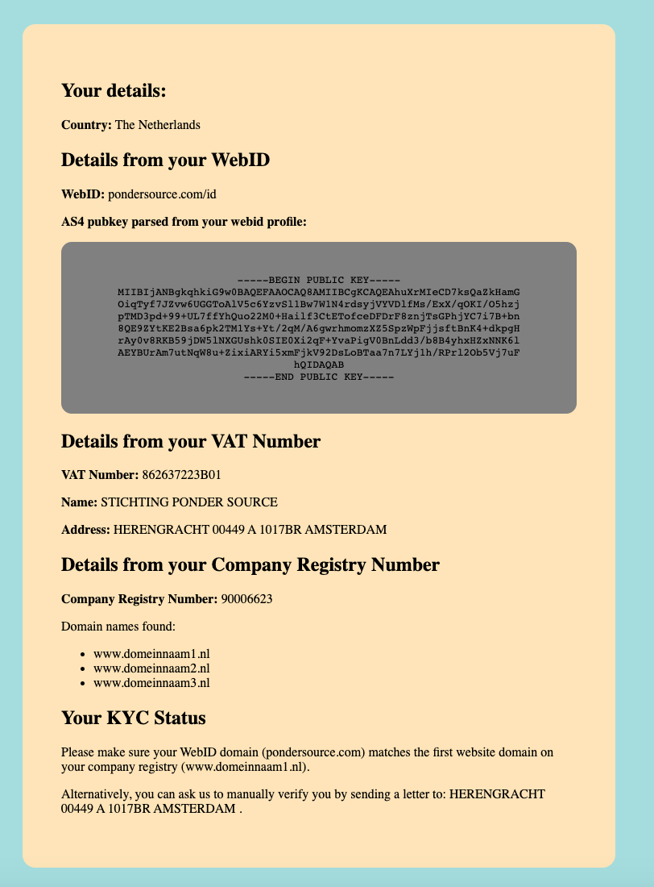

# Peppol for the Masses
## Re-signing Gateway
This code module implements the functionality of the re-signing gateway as described
in milestone 4 of [the MoU](https://github.com/pondersource/peppol-php/blob/main/pftm-mou-annexe-milestones.pdf).
Before you can forward invoices through it, the sender needs to register their public key against a country-issued
company identifier.
Here is an example where the domainname of the WebID does not match the domainname we found in the company registry,
and so registration is denied:


See also [this screencast](https://www.youtube.com/watch?v=OCeLXbKUxiE).

To run it, you have two options: with or without Docker.

### With Docker
```
git clone https://github.com/pondersource/peppol-php
cd peppol-php
./scripts/gencerts.sh
cd re-signing-gateway
docker build -t re-signing-gateway .
docker run -d re-signing-gateway
```

### Without Docker
You will need PHP v7 with the php-soap extension, and composer installed; then you should be able to:
```
git clone https://github.com/pondersource/peppol-php
cd peppol-php
cd re-signing-gateway
composer install
php -S localhost:8080
```
Now you can visit http://localhost:8080/kyc.php

## API Key configuration
The current code uses the test API of the Kamer van Koophandel.
We (Ponder Source) requested an API subscription (5 eur/month) so that we can make API calls to their
live API in production. This request is currently pending so we can only demo with test data at the moment,
but the process is the same.

### How does the KYC process take place?

Our registration form asks you for some details:
* Your WebID, where we can check your public key on your domain name
* Your country of registration
* Your Company Registry Number, where we can also check your domain name
* Your VAT Number, where we can check your address

If we can find an official domain name for your organisation (currently implemented for the Kamer van Koophandel, the Dutch Company Registry),
then we compare that to the domain name on which your WebID is hosted, and if they match, we accept you as authenticated for your organisation.
If not, we can (manually) send a letter with a code to the address that is listed for your organisation in your country's official VAT registry.
We can then (manually) activate your account when you email this code to our support email address.

### A note on VIES

The EU offers an API for querying VAT numbers, called VIES.
As also [noted by others](https://scotthelme.co.uk/how-the-eu-made-our-website-slow/), it often times out, and it has quite strict rate-limiting.
Also, for some countries (e.g. Spain), the response only include a boolean value indicating whether the VAT number is valid (pertains to an
active company or organisation), but it doesn't give a postal address or anything else that can be checked. In those cases, the only option would
be to search for the company name using web search, see which real-world company seems most likely to be registered under the country-issued
identifier, and then contact them to see if the person trying to authenticate to us is known to whoever answers the phone / opens the mail /
answers emails there.